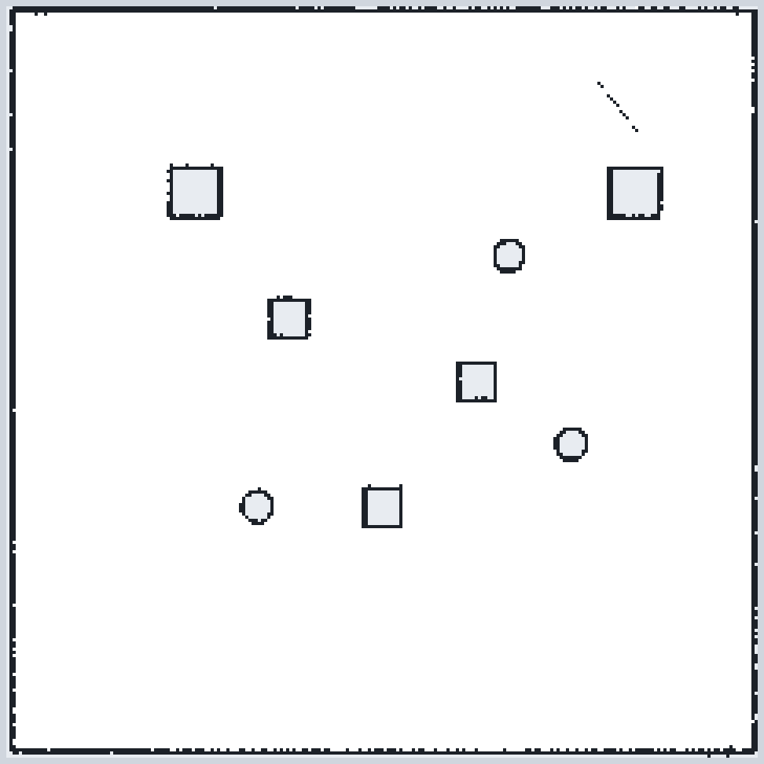
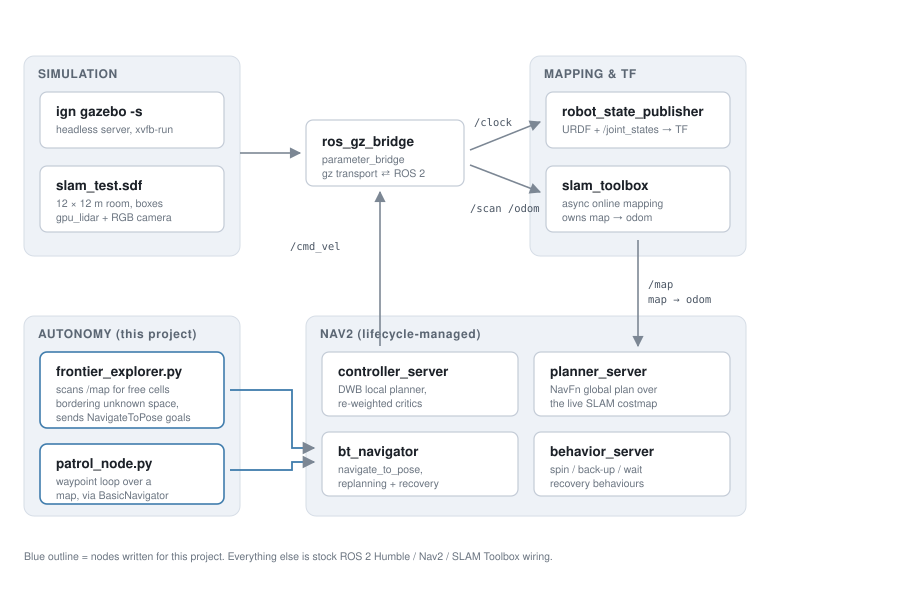

# Autonomous Vacuum Robot — ROS 2 / Nav2 / SLAM

A differential-drive vacuum robot that is dropped into a room it has never seen, builds a map of
it with SLAM Toolbox, and covers the room on its own by repeatedly driving to the boundary
between what it has mapped and what it has not.

Built on ROS 2 Humble with Nav2, SLAM Toolbox and Ignition Gazebo (Fortress), developed entirely
inside a headless Docker container.

<p align="center">
  
</p>
<p align="center">
  <sub><b>Output of a run:</b> the occupancy grid SLAM Toolbox built while the robot explored a
  12 &times; 12 m room. Black is occupied, white is confirmed free, grey is still unknown.
  Saved in <code>maps/</code> and reloadable for patrol mode.</sub>
</p>

---

## What it does

- **Maps an unknown room.** SLAM Toolbox runs in async online mode off a simulated 2D lidar and
  owns the `map -> odom` transform.
- **Explores without being told where to go.** `frontier_explorer.py` reads the live occupancy
  grid, finds *frontiers* — free cells that touch unknown cells — and sends the robot to one as a
  Nav2 `NavigateToPose` goal. When that goal completes it picks the next frontier. The map grows
  until there are no frontiers left, which is the point at which the room has been fully covered.
- **Patrols a room it already knows.** `patrol_node.py` cycles a fixed waypoint loop against a
  saved map — the "already mapped, just clean it" mode.
- **Plans and recovers like a real robot.** Nav2 handles global planning (NavFn), local control
  (DWB), and recovery behaviours when the robot gets stuck.

## Architecture



The stack is deliberately layered so each piece can be run and debugged on its own: `launch_sim`
brings up physics and the ROS/Gazebo bridge, `online_async_launch` adds mapping,
`navigation_launch` adds Nav2, and only then does the exploration node start sending goals.
`bringup_explore.launch.py` stitches all four together with staged `TimerAction` delays.

## What I wrote, and what came from upstream

This package started as a fork of [`joshnewans/articubot_one`](https://github.com/joshnewans/articubot_one)
(Articulated Robotics), which supplied the base URDF, the differential-drive plumbing and the
stock Nav2 launch files. **The autonomy layer and everything that makes it a vacuum robot is mine:**

| File | What it is |
|---|---|
| [`scripts/frontier_explorer.py`](scripts/frontier_explorer.py) | Frontier detection and goal dispatch — the core of the project |
| [`scripts/patrol_node.py`](scripts/patrol_node.py) | Waypoint patrol loop built on `nav2_simple_commander` |
| [`launch/bringup_explore.launch.py`](launch/bringup_explore.launch.py) | One-command bring-up of sim, SLAM, Nav2 and the explorer |
| [`launch/launch_sim.launch.py`](launch/launch_sim.launch.py) | Headless Ignition sim, robot spawn, and the `ros_gz_bridge` topic map |
| [`config/nav2_params.yaml`](config/nav2_params.yaml) | Nav2 retuned for this robot: DWB controller, re-weighted critics, 2D costmaps |
| [`config/mapper_params_online_async.yaml`](config/mapper_params_online_async.yaml) | SLAM Toolbox tuning — 0.05 m grid, 12 m laser range, loop-closure search |
| [`config/ekf.yaml`](config/ekf.yaml) | `robot_localization` EKF, with TF publishing deliberately disabled — see below |
| [`worlds/slam_test.sdf`](worlds/slam_test.sdf) | The 12 &times; 12 m test room with boxes and cylinders to map around |
| [`description/`](description/) | Reworked into parameterised xacro macros with Ignition `gpu_lidar` and camera sensors |

## Engineering notes

The interesting parts of this project were not the happy path — they were the four or five places
where the stack quietly did nothing until the right thing was fixed.

**Swapping the local controller.** The base config used Regulated Pure Pursuit, which kept
overshooting and circling frontier goals in a cluttered room. I moved the controller server to
**DWB** and re-weighted its critics — `PathAlign` and `PathDist` at 32.0 against `BaseObstacle` at
0.02 — so the robot commits to the global path instead of being repelled by every nearby wall in a
6 m-wide space. Velocity and acceleration limits came down to what this chassis can actually hold
(`max_vel_x: 0.26`, `acc_lim_x: 2.5`).

**Two nodes both claiming `odom -> base_link`.** The EKF and the simulator were both publishing
the same transform, so TF had a duplicate-authority fight and the costmaps flickered between two
poses. Fixing it meant deciding who owns what: the EKF now runs with `publish_tf: false` and fuses
odometry for its consumers, the simulator's odometry owns `odom -> base_link`, and SLAM Toolbox
owns `map -> odom`. [`docs/tf_frames.pdf`](docs/tf_frames.pdf) is the `view_frames` capture from
working that out.

**Costmap layer mismatch.** The stock config used a `VoxelLayer`, which expects 3D point-cloud
data. This robot only has a planar lidar, so the voxel layer had nothing to mark and obstacles
never made it into the local costmap. Replaced with a plain `ObstacleLayer` subscribed to `/scan`.

**Parameter overrides that actually win.** A few controller-server values have to be applied
*after* `nav2_params.yaml` is loaded. `navigation_launch.py` layers
[`config/dwb_critics_override.yaml`](config/dwb_critics_override.yaml) on top of the main
parameter file for that one node, rather than duplicating a whole config to change three keys.

**Start order matters.** Launching everything at once fails silently: SLAM will not publish
`map -> odom` before `/scan` and `/clock` exist, Nav2's costmaps refuse to activate without that
transform, and the explorer's first goal is rejected if the `navigate_to_pose` action server is not
up yet. The bring-up stages the four layers 8/10/12 seconds apart.

**Headless simulation.** Development ran in a container with no display. Gazebo is launched
server-only under `xvfb-run` so the lidar and camera sensor plugins still have something to render
against.

## Repository layout

```
config/          Nav2, SLAM Toolbox, EKF, controller and twist-mux parameters
description/     URDF/xacro — chassis, drive, lidar, camera, inertials
launch/          Simulation, SLAM, Nav2, and the combined exploration bring-up
maps/            Occupancy grid saved from a SLAM run, for patrol mode
rviz/            RViz layouts for driving, mapping and navigating
scripts/         frontier_explorer.py, patrol_node.py  <- the autonomy nodes
worlds/          Ignition test worlds
docs/            Architecture diagram, saved map, TF capture
```

## Running it

Requires ROS 2 Humble, Ignition Gazebo Fortress, and the Nav2 / SLAM Toolbox stack.

```bash
mkdir -p ~/ros2_ws/src && cd ~/ros2_ws/src
git clone https://github.com/samerodeh/autonomous_vaccum.git articubot_one
```

```bash
cd ~/ros2_ws
rosdep install --from-paths src --ignore-src -r -y
colcon build --packages-select articubot_one
source install/setup.bash
```

Full autonomous exploration — sim, SLAM, Nav2 and the frontier explorer in one command:

```bash
ros2 launch articubot_one bringup_explore.launch.py
```

Or bring the layers up one at a time, in separate terminals:

```bash
ros2 launch articubot_one launch_sim.launch.py
ros2 launch articubot_one online_async_launch.py
ros2 launch articubot_one navigation_launch.py use_sim_time:=true
ros2 run articubot_one frontier_explorer.py
```

Patrol a saved map instead of exploring:

```bash
ros2 launch articubot_one patrol.launch.py
```

Save the map once exploration settles:

```bash
ros2 run nav2_map_server map_saver_cli -f ~/my_map
```

## Status and next steps

The exploration stack runs end to end — the map at the top of this page came out of it. The honest
list of what I would do next:

- **Frontier selection is naive.** `detect_frontiers()` walks the grid in Python on every `/map`
  callback and takes the first frontier in raster order, which is not the closest one. Clustering
  frontier cells and scoring candidates on distance and information gain — vectorised with NumPy
  instead of a per-cell loop — is the obvious next step.
- **No coverage guarantee.** Frontier exploration maps the room; a vacuum also needs a
  boustrophedon coverage pass over the finished map. That is the next feature, not a bug fix.
- **Two worlds, two plugin conventions.** `slam_test.sdf` uses Fortress `libignition-gazebo-*`
  plugin names while `empty_world.sdf` uses the newer `gz-sim-*` names. These should be unified
  against one Gazebo version, and with them the bridge type names (`gz.msgs` vs `ignition.msgs`)
  and the sensor frame tag in the xacro (`gz_frame_id` vs `ignition_frame_id`).
- **No tests.** The frontier maths is pure functions over a NumPy array and should have unit tests
  that do not need a simulator running.

## Attribution and licence

Forked from [`joshnewans/articubot_one`](https://github.com/joshnewans/articubot_one) by Josh Newans
(Articulated Robotics), itself derived from his [`my_bot`](https://github.com/joshnewans/my_bot)
template (Apache-2.0). The upstream `articubot_one` repository does not declare a licence; the base
robot description and the stock Nav2 launch files are his work and are used here with credit. The
Apache-2.0 licence in [`LICENSE`](LICENSE) covers my own contributions — the autonomy nodes, the
configuration tuning, the simulation bring-up and the documentation.
